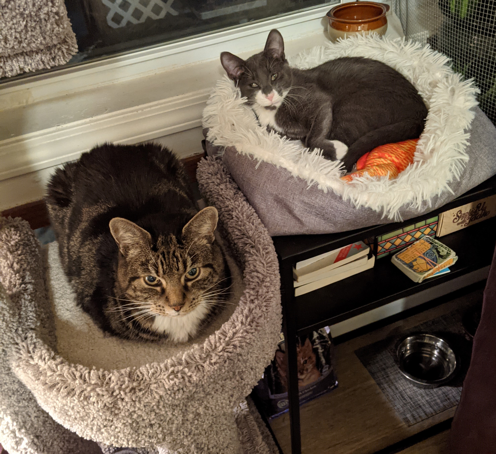

+++
# A Demo section created with the Blank widget.
# Any elements can be added in the body: https://sourcethemes.com/academic/docs/writing-markdown-latex/
# Add more sections by duplicating this file and customizing to your requirements.

widget = "blank"  # See https://sourcethemes.com/academic/docs/page-builder/
headless = true  # This file represents a page section.
active = true # Activate this widget? true/false
weight = 20  # Order that this section will appear.

title = ""
subtitle = ""

[design]
  # Choose how many columns the section has. Valid values: 1 or 2.
  columns = "1"

[design.background]
  # Apply a background color, gradient, or image.
  #   Uncomment (by removing `#`) an option to apply it.
  #   Choose a light or dark text color by setting `text_color_light`.
  #   Any HTML color name or Hex value is valid.

  # Background color.
  # color = "navy"
  
  # Background gradient.
  # gradient_start = "DeepSkyBlue"
  # gradient_end = "SkyBlue"
  
  # Background image.
  image = ""  # Name of image in `static/img/`.
  image_darken = 0.6  # Darken the image? Range 0-1 where 0 is transparent and 1 is opaque.

  # Text color (true=light or false=dark).
  text_color_light = false

[design.spacing]
  # Customize the section spacing. Order is top, right, bottom, left.
  padding = ["20px", "0", "20px", "0"]

[advanced]
 # Custom CSS. 
 css_style = ""
 
 # CSS class.
 css_class = "mini"
+++

# About me

I grew up in Eastern Washington, surrounded by wheat fields and apple orchards. My grandpa owned a small fertilizer business, and when I was young he would take me on trips to check on his customers' fields. Those experiences taught me an early appreciation for agriculture, soils, and plants. I got my research start through summer internships at the Pacific Northwest National Laboratory, which inspired me to pursue a career in science. I'm currently working on my PhD in Soil Science at Cornell. Over time I've picked up programming and data science skills which excite me as much as the soils and microorganisms that lead me to them.

My hobbies include experimenting in the kitchen, reading,  playing tabletop games with friends, and taking my spoiled cats on walks outside. I go on iNaturalist hikes with my partner to catalog any and all of the plants, mushrooms, and animals that we can find.

    

        
    

  
  <table class="inat-footer">
    <tr class="inat-user">
        <td class="inat-user-image">
          
        </td>
      <td class="inat-value">
        <strong>
            <a href="https://www.inaturalist.org/observations/cassci">View cassci's observations »</a>
        </strong>
      </td>
    </tr>
  </table>

My spoiled boys, TCAT and Merlin:

