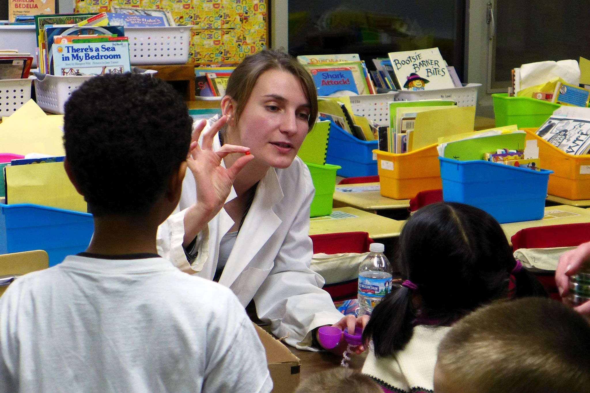
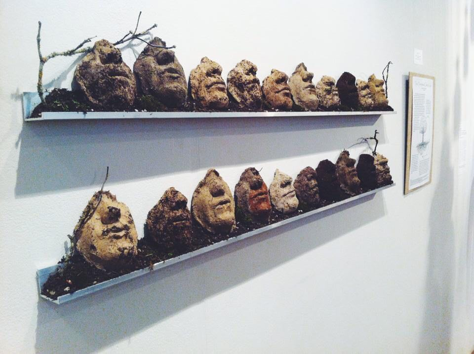

+++
# A Demo section created with the Blank widget.
# Any elements can be added in the body: https://sourcethemes.com/academic/docs/writing-markdown-latex/
# Add more sections by duplicating this file and customizing to your requirements.

widget = "blank"  # See https://sourcethemes.com/academic/docs/page-builder/
headless = true  # This file represents a page section.
active = true # Activate this widget? true/false
weight = 20  # Order that this section will appear.

title = ""
subtitle = ""

[design]
  # Choose how many columns the section has. Valid values: 1 or 2.
  columns = "1"

[design.background]
  # Apply a background color, gradient, or image.
  #   Uncomment (by removing `#`) an option to apply it.
  #   Choose a light or dark text color by setting `text_color_light`.
  #   Any HTML color name or Hex value is valid.

  # Background color.
  # color = "navy"
  
  # Background gradient.
  # gradient_start = "DeepSkyBlue"
  # gradient_end = "SkyBlue"
  
  # Background image.
  image = ""  # Name of image in `static/img/`.
  image_darken = 0.6  # Darken the image? Range 0-1 where 0 is transparent and 1 is opaque.

  # Text color (true=light or false=dark).
  text_color_light = false

[design.spacing]
  # Customize the section spacing. Order is top, right, bottom, left.
  padding = ["20px", "0", "20px", "0"]

[advanced]
 # Custom CSS. 
 css_style = ""
 
 # CSS class.
 css_class = "mini"
+++

# Outreach

### Science communication

#### USA Science Festival

I helped the Buckley lab create and man a microbiome-themed booth for the [USA Science & Engineering Festival](https://usasciencefestival.org/) in 2018. The booth featured live microscopy of protists from termite guts and freshwater algae, free cardboard microscopes for home use, and a microbiome puzzle game.

Check out this [blog post](https://blogs.cornell.edu/best/2018/10/31/explaining-science-to-kids-builds-vital-career-skills/) that I co-wrote with Janani Hariharan where we reflect on lessons learned from this event.

#### Whiterock Conservency Bioblitz

I lead soil sessions for the [Whiterock Conservancy](https://www.whiterockconservancy.org/) Bioblitz in the summers of 2015 and 2016. I designed hands-on activities to get people thinking about the importance of soil health and ecology. You can see various clips of me leading sessions starting around 6 minutes into this video made by Iowa PBS.

<iframe width="560" height="315" src="https://www.youtube.com/embed/IK7AQDxVg3E" frameborder="0" allow="accelerometer; autoplay; clipboard-write; encrypted-media; gyroscope; picture-in-picture" allowfullscreen></iframe>

 

#### Edwards Elementary School Science Night

As part of the Microbiology Graduate Student Organization at Iowa State University, I organized and lead hands-on activities for the yearly Edwards Elementary Science Night. Activities included such hits as the "build-a-microbe" station, fluorescent hand washing, and live microscopy of pond water.

<figure>
  
  <figcaption>Me, teaching children about bacterial physiology using craft supplies.</figcaption>
</figure>

#### Science Art: "Soil Breaths"

As an undergraduate at Western Washington University, I took an inter-disciplinary art and ecology course. I partnered with two art students to create a piece that communicated a scientific concept to its viewers. We made casts of our own faces and used the mold to create clay and soil masks. The casts represent how soils breath carbon dioxide out (just like us) as part of the global carbon cycle. The art was displayed in the Western Gallery at Western Washington University, Bellingham, WA in 2014.

<figure>
  
  <figcaption>"Soil Breaths" By Bonita Robins, Cassandra Wattenburger, and Cecelia Hanford</figcaption>
</figure>

### Diversity, equity, and inclusion

#### Expanding Your Horizons

[Expanding Your Horizons](https://www.eyh.cornell.edu/) is a program hosted by Cornell that's aimed towards introducing middle-school girls to science by pairing them with a graduate student "buddy" and hosting fun science workshops to pique their interest in various fields. I've enjoyed spending a day each year buddying with a student and stoking her interest in STEM.

#### Diversity Preview Weekend

[Diversity Preview Weekend](http://www.cornelldpw.org/) is a graduate-student led program that helps undergraduates from underprivileged backgrounds learn about and prepare for graduate school. My involvement has included serving on advice panels, volunteering at events, and reviewing and discussing graduate school application materials with participants.

#### Science Bound

[Science Bound](http://www.sciencebound.iastate.edu/) is an initiative at Iowa State University that empower underrepresented students in Iowa to explore STEM degrees and careers. I organized and lead a variety of microbiology workshops for ages ranging from elementary to high school students. This included a workshop to teach students about bacteria living on plant leaves, and a multi-workshop event to introduce high schoolers to careers in microbiology and various topics therein, such as microbiology in human health and the environment.