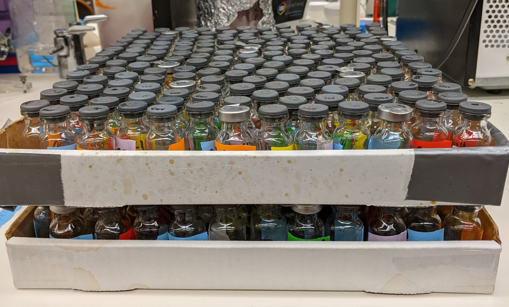
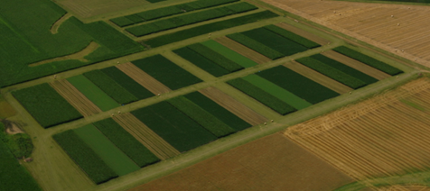

+++
# A Demo section created with the Blank widget.
# Any elements can be added in the body: https://sourcethemes.com/academic/docs/writing-markdown-latex/
# Add more sections by duplicating this file and customizing to your requirements.

widget = "blank"  # See https://sourcethemes.com/academic/docs/page-builder/
headless = true  # This file represents a page section.
active = true # Activate this widget? true/false
weight = 20  # Order that this section will appear.

title = ""
subtitle = ""

[design]
  # Choose how many columns the section has. Valid values: 1 or 2.
  columns = "1"

[design.background]
  # Apply a background color, gradient, or image.
  #   Uncomment (by removing `#`) an option to apply it.
  #   Choose a light or dark text color by setting `text_color_light`.
  #   Any HTML color name or Hex value is valid.

  # Background color.
  # color = "navy"
  
  # Background gradient.
  # gradient_start = "DeepSkyBlue"
  # gradient_end = "SkyBlue"
  
  # Background image.
  image = ""  # Name of image in `static/img/`.
  image_darken = 0.6  # Darken the image? Range 0-1 where 0 is transparent and 1 is opaque.

  # Text color (true=light or false=dark).
  text_color_light = false

[design.spacing]
  # Customize the section spacing. Order is top, right, bottom, left.
  padding = ["20px", "0", "20px", "0"]

[advanced]
 # Custom CSS. 
 css_style = ""
 
 # CSS class.
 css_class = "mini"
+++

# Research

### Research interests

* Microbial ecology 🦠
* Soil and plant health 🌾
* Genomics and metagenomics 🧬
* Data science 💻

### Projects

#### PhD: In-situ bacterial growth rates and soil C cycling

For my PhD research in the Buckley lab at Cornell, I'm measuring in-situ bacterial growth in soils for individual taxa. Bacterial growth is closely tied with bacterial metabolism, and drives organic matter decomposition and, by extension, the soil carbon cycle. I'm using this data to predict microbial traits from growth patterns and explore how microbial community growth dynamics impact C cycling in soils.

 

#### MS: Impacts of agricultural management on rhizosphere microbial communities

I did my MS at Iowa State University co-advised between the [Halverson](https://www.plantpath.iastate.edu/people/larry-halverson) and [Hofmockel](http://kirstenhofmockel.org/) labs. There, I took advantage of the [Marsden long-term rotation site](https://www.cals.iastate.edu/inrc/marsden-long-term-rotation-study) (see left)  to investigate how agricultural management effects maize root-associated microbial communities, with a particular emphasis on taxa important for nitrogen acquisition.

 

#### Internships at the Pacific Northwest National Laboratory

I interned at the [Pacific Northwest National Laboratory](https://www.pnnl.gov/) each summer during my undergraduate years in [Dr. Vanessa Bailey's lab](https://www.pnnl.gov/science/staff/staff_info.asp?staff_num=5776). Here, I learned the basics of experimental design, research conduct, and various methods commonly used in microbial ecology. I worked on various projects, including comparing bacterial and fungal respiration in agricultural soils, developing a DNA extraction technique for individual soil aggregates, and the effect of gradual warming on soil community exo-metabolite production.

### Publications

[Google Scholar](https://scholar.google.com/citations?user=vDgzwVIAAAAJ&hl=en)

1. **Wattenburger, C.J.**, Gutknecht, J., Zhang, Q., Brutnell, T., Hofmockel, K., Halverson, L., 2020. The rhizosphere and cropping system, but not arbuscular mycorrhizae, affect ammonia oxidizing archaea and bacteria abundances in two agricultural soils. Applied Soil Ecology 151, 103540. [doi:10.1016/j.apsoil.2020.103540](https://linkinghub.elsevier.com/retrieve/pii/S0929139319309606)

1. **Wattenburger, C.J.**, Halverson, L.J., Hofmockel, K.S., 2019. Agricultural Management Affects Root-Associated Microbiome Recruitment Over Maize Development. Phytobiomes Journal 3, 260–272. [doi:10.1094/PBIOMES-03-19-0016-R](https://apsjournals.apsnet.org/doi/10.1094/PBIOMES-03-19-0016-R)

1. Karig, D.E., Mayers, C.G., **Wattenburger, C.J.**, Southon, J., 2020. CONTAMINATION OF RADIOCARBON ANALYSES OF PLANT SAMPLES BY FUNGAL HYPHAE. Radiocarbon 1–8. [doi:10.1017/RDC.2020.124](https://www.cambridge.org/core/journals/radiocarbon/article/contamination-of-radiocarbon-analyses-of-plant-samples-by-fungal-hyphae/3D6CDD77BECCA4B4D8227A3E298D9F70)

### Talks & Posters

#### Talks

1. **Predicting microbial life history traits from their growth dynamics in soil**, Cornell Soil and Crop Sciences seminar, Cornell University, April 2020
1. **The root-associated microbiome and agricultural nitrogen use efficiency**, Master's exit seminar, Iowa State University, Nov 2017
1. **Spatio-temporal dynamics of root-associated prokaryotic communities in two contrasting agroecosystems**, Iowa State University Interdepartmental Microbiology Program Retreat, Iowa State University, Oct 2017
1. **Studying individual soil aggregates as discrete habitats for microbial communities**, SULI symposium, Richland, WA, Aug 2012
1. **Revisiting fungal-to-bacterial activity ratios in soils ten years later**, SULI symposium, Richland, WA, Aug 2011

#### Posters

1. **Comparing in-situ, individual bacterial growth rates in cropped and successional soils using a 16S rRNA internal standard**, DOE GPS Meeting, Virtual, Feb 2021  poster pdf
1. **In contrasting cropping systems, root-associated prokaryotic and fungal communities exhibit distinct shifts at different maize developmental stages**, Multi-omics for Microbiomes Conference, Richland, WA, Aug 2017  poster pdf
1. **Arbuscular mycorrhizae alter soil inorganic and plant nitrogen but have little effect on ammonia oxidizing community abundance in two agricultural soils**, Ecological Society of America Conference, Portland, OR, Aug 2017  poster pdf
